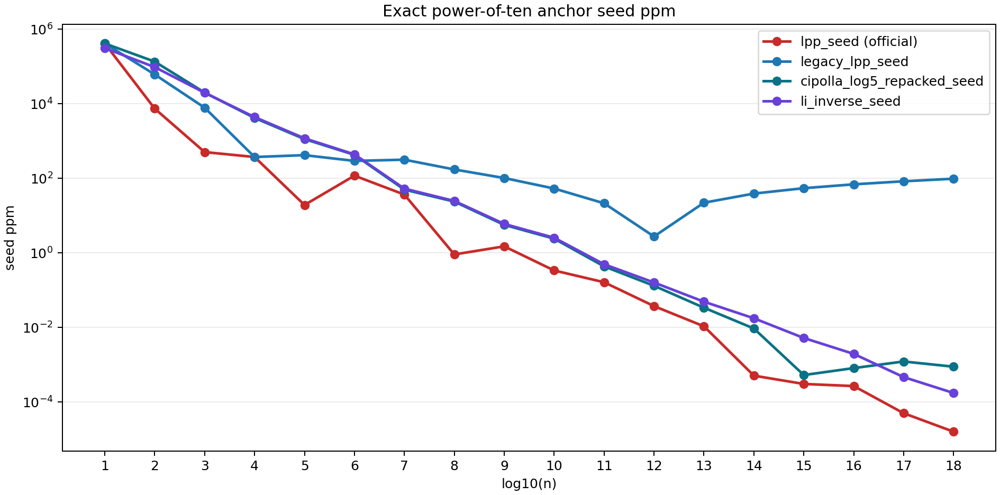

# Lorentz Prime Predictor

The Lorentz Prime Predictor is a research repo with one primary goal: build a scientifically defensible seed for the $n$th prime by treating prime growth as something to be measured against a stable scale rather than read as raw magnitude alone.

The benchmark program and the minimal runtime surface are supporting parts of that goal. The benchmarks test whether the measurement idea produces a real advantage. The runtime keeps the result narrow, deterministic, and easy to audit as a research instrument.

The official repository benchmark suite is now the exact power-of-ten anchor suite on

$$ n = 10^1,\dots,10^{18}. $$

It compares the four main formulas on one clean exact surface with no stage labels:

- `lpp_seed`
- `legacy_lpp_seed`
- `cipolla_log5_repacked_seed`
- `li_inverse_seed`

In relativity, motion becomes more informative when it is written as $v/c$ instead of as a bare speed. This repository carries that same measurement instinct into number theory. The point is not that primes obey relativity as physics. The point is that invariant-normalized measurement may reveal cleaner structure in the problem of estimating $p_n$.

That idea led to two different lines of work.

One line stayed in closed form. It asked for the strongest fully derived algebraic seed we could defend without smuggling in chosen constants. The best result from that line is `cipolla_log5_repacked`. It is the strongest retained closed-form seed in the repository. On the official exact benchmark suite, it stays ahead of `li_inverse_seed` through exact `10^16`, then loses at exact `10^17` and exact `10^18`.

The other line stopped asking for a prettier algebraic correction and asked a different question: if the counting model is better, should the seed come from inverting that better model directly? That produced `r_inverse_seed`, a deterministic inversion seed built from a truncated Riemann counting function and a fixed Newton rule. On the official exact benchmark suite, it is sole best on `16` anchors, tied best at `10^4`, and best-or-tied-best on every anchor from `10^2` through `10^18`.

Those are different kinds of objects, so the repository keeps them separate. `cipolla_log5_repacked` is the best retained answer to the closed-form question. `r_inverse_seed` is the strongest exact seed result now in hand. They are judged on the same official benchmark suite, but they are not collapsed into one claim.

The decade-anchor view makes the split visible. The closed-form line stays competitive for a surprisingly long stretch and remains the best retained closed-form answer through exact $10^{16}$. The inversion line is the one that keeps winning when the horizon gets harder. That is the sharpest result in the repository: the strongest exact advance did not come from a prettier algebraic correction. It came from changing what was inverted.

The shipped runtime surface is still intentionally narrow. The public implementation remains `lpp_seed` and `lpp_refined_predictor`, but `lpp_seed` now uses the deterministic `r_inverse` construction as the official runtime path. The older formulas remain in code as alternates. Published exact runtime values remain committed on the power-of-ten grid

$$ n = 10^0,\dots,10^{24}. $$

The benchmark result and the runtime default are now aligned: the strongest exact seed result in hand is also the shipped seed path.

The benchmark language also stays narrow. This repository keeps three provenance classes separate: `published exact`, `reproducible exact`, and `local continuation`. Exact results and local continuation results are both useful, but they are not described as the same kind of evidence. The official benchmark suite uses only the published exact anchor class. The older stage-based exact and local runs remain available as supporting research artifacts, not as the top-level benchmark surface.

## Where To Read Next

If you want the clean current decisions, start with [docs/CANDIDATE_CATEGORIES.md](./docs/CANDIDATE_CATEGORIES.md).

If you want the shipped runtime contract, read:

- [docs/FORMULA.md](./docs/FORMULA.md)
- [docs/METHOD.md](./docs/METHOD.md)
- [docs/API.md](./docs/API.md)

If you want the benchmark rules and claim boundaries, read:

- [docs/BENCHMARK_PROTOCOL.md](./docs/BENCHMARK_PROTOCOL.md)
- [docs/CLAIMS.md](./docs/CLAIMS.md)
- [docs/VALIDATION_STATUS.md](./docs/VALIDATION_STATUS.md)

If you want the official benchmark suite artifact, read:

- [benchmarks/power_of_ten_anchor_suite/README.md](./benchmarks/power_of_ten_anchor_suite/README.md)

If you want the origin of the measurement idea, read [docs/ORIGIN.md](./docs/ORIGIN.md).

If you want supporting benchmark artifacts for the retained leaders, read:

- [benchmarks/cipolla_repacked_probe/README.md](./benchmarks/cipolla_repacked_probe/README.md)
- [benchmarks/r_inverse_probe/README.md](./benchmarks/r_inverse_probe/README.md)

The older stage-by-stage scaling notes for the shipped `lpp_seed` program remain available as historical support in:

- [docs/SCALING_RESULTS.md](./docs/SCALING_RESULTS.md)
- [docs/SCALING_INTERPRETATION.md](./docs/SCALING_INTERPRETATION.md)
