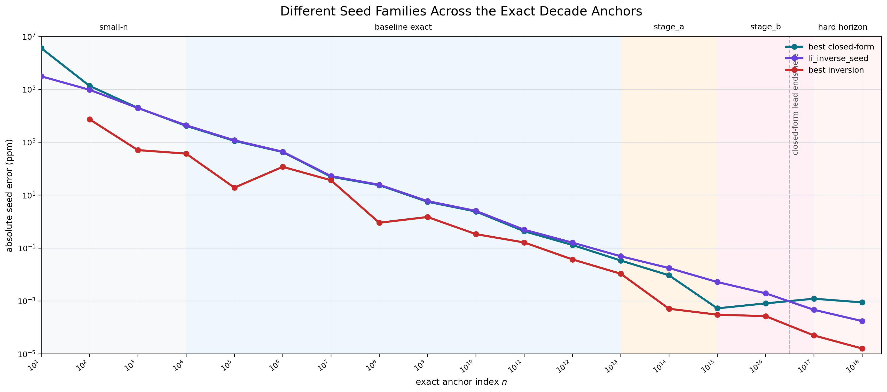

# Lorentz Prime Predictor

The Lorentz Prime Predictor is a research repo about one narrow question: how should we build a seed for the $n$th prime if we treat prime growth as something to be measured against a stable scale rather than read as raw magnitude alone?

In relativity, motion becomes more informative when it is written as $v/c$ instead of as a bare speed. This repository carries that same measurement instinct into number theory. The point is not that primes obey relativity as physics. The point is that invariant-normalized measurement may reveal cleaner structure in the problem of estimating $p_n$.

That idea led to two different lines of work.

One line stayed in closed form. It asked for the strongest fully derived algebraic seed we could defend without smuggling in chosen constants. The best result from that line is `cipolla_log5_repacked`. It is the strongest retained closed-form seed in the repository. On the exact benchmark suite, it stays ahead of `li_inverse_seed` through exact `10^16`, then loses at exact `10^17` and exact `10^18`.

The other line stopped asking for a prettier algebraic correction and asked a different question: if the counting model is better, should the seed come from inverting that better model directly? That produced `r_inverse_seed`, a deterministic inversion seed built from a truncated Riemann counting function and a fixed Newton rule. On the exact evidence now committed in the repository, it beats `li_inverse_seed` on exact anchors from `10^12` through `10^18` and across every exact family in `stage_a` and `stage_b`.

Those are different kinds of objects, so the repository keeps them separate. `cipolla_log5_repacked` is the best retained answer to the closed-form question. `r_inverse_seed` is the strongest exact seed result now in hand. They are judged on the same benchmark suite, but they are not collapsed into one claim.

The decade-anchor view makes the split visible. The closed-form line stays competitive for a surprisingly long stretch and remains the best retained closed-form answer through exact $10^{16}$. The inversion line is the one that keeps winning when the horizon gets harder. That is the sharpest result in the repository: the strongest exact advance did not come from a prettier algebraic correction. It came from changing what was inverted.

The shipped runtime surface is still intentionally narrow. The public implementation remains `lpp_seed` and `lpp_refined_predictor`, with published exact runtime values on the committed power-of-ten grid

$$ n = 10^0,\dots,10^{24}. $$

The newer leaders are benchmark-backed retained candidates. They are part of the repository's scientific record, but they are not silently folded into the minimal runtime API.

The benchmark language also stays narrow. This repository keeps three provenance classes separate: `published exact`, `reproducible exact`, and `local continuation`. Exact results and local continuation results are both useful, but they are not described as the same kind of evidence.

## Where To Read Next

If you want the clean current decisions, start with [docs/CANDIDATE_CATEGORIES.md](./docs/CANDIDATE_CATEGORIES.md).

If you want the shipped runtime contract, read:

- [docs/FORMULA.md](./docs/FORMULA.md)
- [docs/METHOD.md](./docs/METHOD.md)
- [docs/API.md](./docs/API.md)

If you want the benchmark rules and claim boundaries, read:

- [docs/BENCHMARK_PROTOCOL.md](./docs/BENCHMARK_PROTOCOL.md)
- [docs/CLAIMS.md](./docs/CLAIMS.md)
- [docs/VALIDATION_STATUS.md](./docs/VALIDATION_STATUS.md)

If you want the origin of the measurement idea, read [docs/ORIGIN.md](./docs/ORIGIN.md).

If you want the supporting benchmark artifacts for the two retained leaders, read:

- [benchmarks/cipolla_repacked_probe/README.md](./benchmarks/cipolla_repacked_probe/README.md)
- [benchmarks/r_inverse_probe/README.md](./benchmarks/r_inverse_probe/README.md)

The older stage-by-stage scaling notes for the shipped `lpp_seed` program remain available in:

- [docs/SCALING_RESULTS.md](./docs/SCALING_RESULTS.md)
- [docs/SCALING_INTERPRETATION.md](./docs/SCALING_INTERPRETATION.md)
