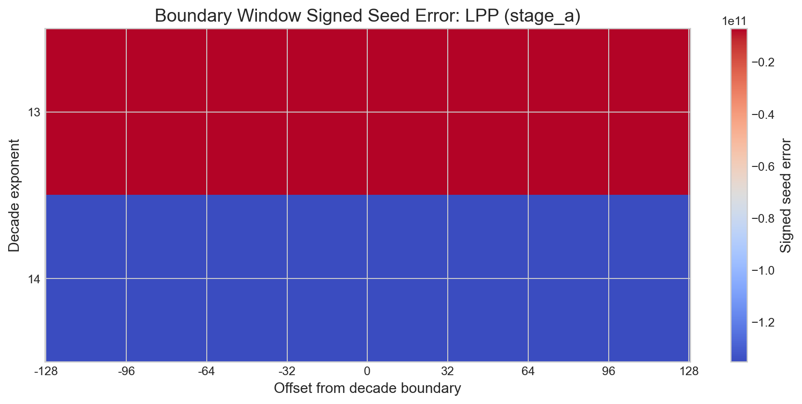
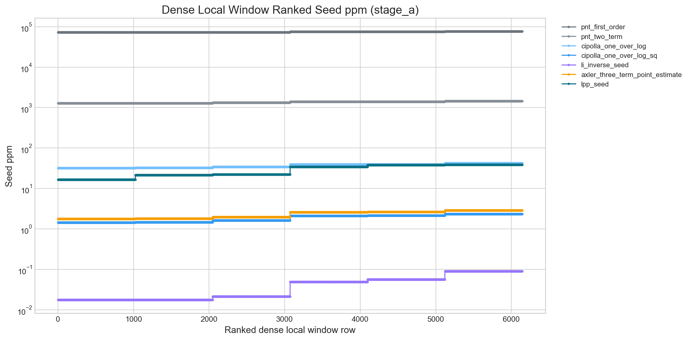
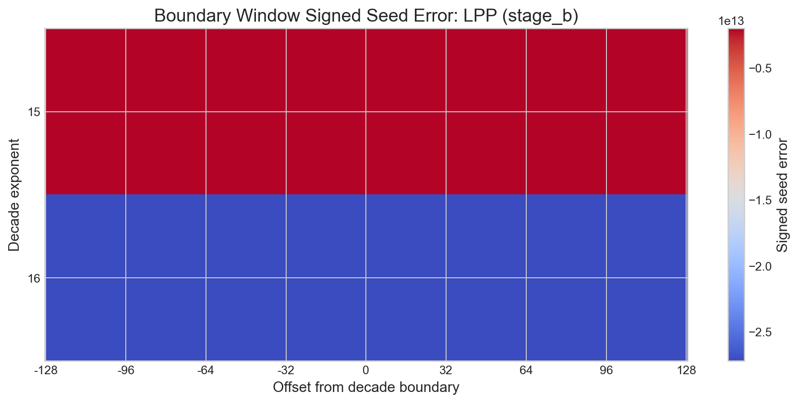
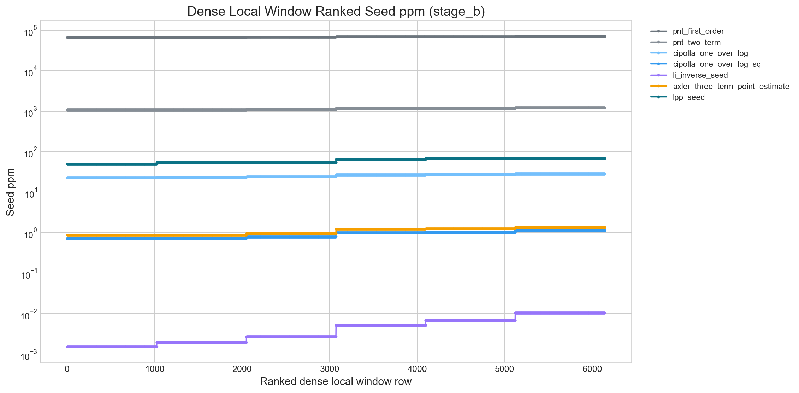
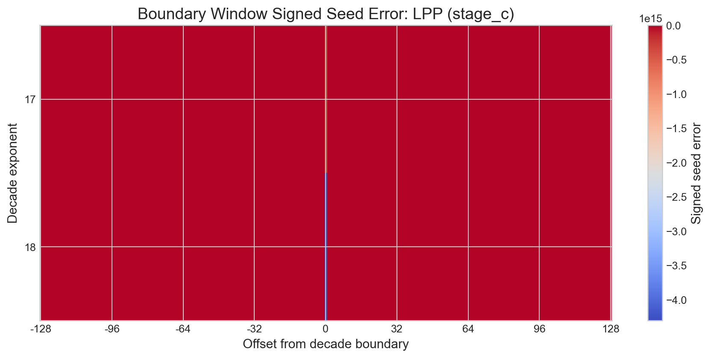
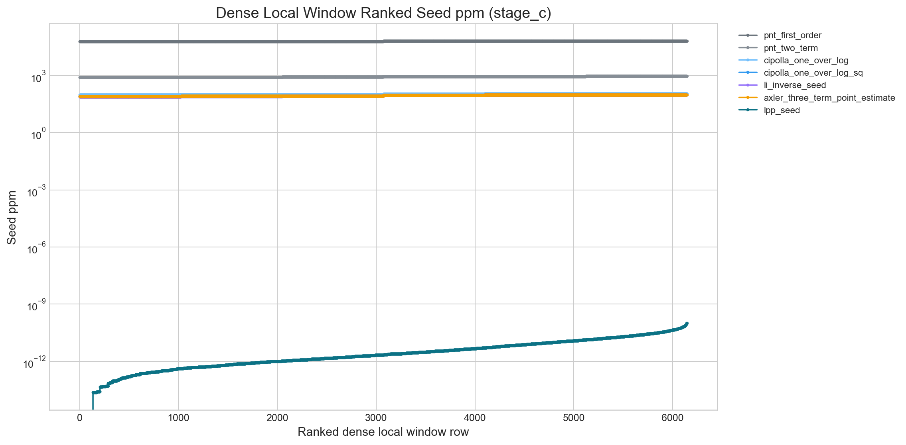

# Off-Lattice Adversarial Benchmark

LPP loses the worst-case seed ppm lead on at least one declared scaling stage.

## Declared Horizon

This benchmark combines the stages currently available in the repository: $10^4 \ldots 10^{12}$, $10^{13} \ldots 10^{14}$, $10^{15} \ldots 10^{16}$, $10^{17} \ldots 10^{18}$ (Z5D-backed).

Implemented stages:

- `baseline`: $10^4 \ldots 10^{12}$ from committed exact artifact
- `stage_a`: $10^{13} \ldots 10^{14}$ from committed exact artifact
- `stage_b`: $10^{15} \ldots 10^{16}$ from committed exact artifact
- `stage_c`: $10^{17} \ldots 10^{18}$ (Z5D-backed) from workspace Z5D C predictor

Families:

- `off_lattice_decimal`: $m \cdot 10^k$ with $m = 2,\dots,9$
- `boundary_window`: all integers in $[10^k - 128,\; 10^k + 128]$
- `dense_local_window`: deterministic local sweeps of length $1024$ at lower, middle, and upper locations inside each new stage exponent

## Mechanical Conclusion

Conclusion: `does not survive`.

| Stage | Family | LPP max ppm | Best classical by max ppm | Classical max ppm | LPP / classical max ratio | Best mean comparator |
| --- | --- | ---: | --- | ---: | ---: | --- |
| stage_a | boundary_window | 38.935561 | li_inverse_seed | 0.048934 | 795.677992 | li_inverse_seed |
| stage_a | dense_local_window | 38.935561 | li_inverse_seed | 0.089328 | 435.871126 | li_inverse_seed |
| stage_a | off_lattice_decimal | 53.608778 | li_inverse_seed | 0.050585 | 1059.774449 | li_inverse_seed |
| stage_b | boundary_window | 68.900290 | li_inverse_seed | 0.005202 | 13244.415233 | li_inverse_seed |
| stage_b | dense_local_window | 68.900290 | li_inverse_seed | 0.010553 | 6529.176853 | li_inverse_seed |
| stage_b | off_lattice_decimal | 82.532361 | li_inverse_seed | 0.003699 | 22312.597393 | li_inverse_seed |
| stage_c | boundary_window | 97.402887 | li_inverse_seed | 97.412202 | 0.999904 | lpp_seed |
| stage_c | dense_local_window | 0.000000 | li_inverse_seed | 97.412202 | 0.000000 | lpp_seed |
| stage_c | off_lattice_decimal | 0.000000 | li_inverse_seed | 111.087273 | 0.000000 | lpp_seed |

## Best Seed Max ppm by Stage and Family

| Stage | Family | Winner | Max ppm |
| --- | --- | --- | ---: |
| baseline | boundary_window | lpp_seed | 1250.589220 |
| baseline | off_lattice_decimal | lpp_seed | 651.648898 |
| stage_a | boundary_window | li_inverse_seed | 0.048934 |
| stage_a | dense_local_window | li_inverse_seed | 0.089328 |
| stage_a | off_lattice_decimal | li_inverse_seed | 0.050585 |
| stage_b | boundary_window | li_inverse_seed | 0.005202 |
| stage_b | dense_local_window | li_inverse_seed | 0.010553 |
| stage_b | off_lattice_decimal | li_inverse_seed | 0.003699 |
| stage_c | boundary_window | lpp_seed | 97.402887 |
| stage_c | dense_local_window | lpp_seed | 0.000000 |
| stage_c | off_lattice_decimal | lpp_seed | 0.000000 |

## Best Seed Mean ppm by Stage and Family

| Stage | Family | Winner | Mean ppm |
| --- | --- | --- | ---: |
| baseline | boundary_window | lpp_seed | 230.873811 |
| baseline | off_lattice_decimal | cipolla_one_over_log | 143.172977 |
| stage_a | boundary_window | li_inverse_seed | 0.033257 |
| stage_a | dense_local_window | li_inverse_seed | 0.041800 |
| stage_a | off_lattice_decimal | li_inverse_seed | 0.017588 |
| stage_b | boundary_window | li_inverse_seed | 0.003575 |
| stage_b | dense_local_window | li_inverse_seed | 0.004808 |
| stage_b | off_lattice_decimal | li_inverse_seed | 0.001616 |
| stage_c | boundary_window | lpp_seed | 0.351334 |
| stage_c | dense_local_window | lpp_seed | 0.000000 |
| stage_c | off_lattice_decimal | lpp_seed | 0.000000 |

## Worst-Case Seed Rows Overall

| Comparator | Stage | Family | n | Seed ppm | Seed signed error |
| --- | --- | --- | ---: | ---: | ---: |
| pnt_first_order | baseline | boundary_window | 9926 | 121341.246405 | -12615 |
| pnt_first_order | baseline | boundary_window | 9925 | 121336.014084 | -12613 |
| pnt_first_order | baseline | boundary_window | 9927 | 121278.867333 | -12609 |
| pnt_first_order | baseline | boundary_window | 9922 | 121228.453461 | -12596 |
| pnt_first_order | baseline | boundary_window | 10118 | 121226.961509 | -12872 |
| pnt_first_order | baseline | boundary_window | 9923 | 121207.163685 | -12595 |
| pnt_first_order | baseline | boundary_window | 9921 | 121206.287480 | -12592 |
| pnt_first_order | baseline | boundary_window | 9928 | 121189.970087 | -12600 |
| pnt_first_order | baseline | boundary_window | 10119 | 121182.442295 | -12868 |
| pnt_first_order | baseline | boundary_window | 9929 | 121178.314852 | -12600 |

## Visualization Index

### Stage Seed Max ppm by Family

This is the lead figure because it answers the scaling question directly in the tail.

### Stage Seed Mean ppm by Family

This shows whether the average-error story matches or diverges from the tail story.

### LPP vs Best Classical Ratio

Ratios below $1$ mean LPP is better on that metric in that stage-family cell.

### Boundary Signed Error Heatmap: stage_a

### Dense Local Window Ranked Seed ppm: stage_a

### Boundary Signed Error Heatmap: stage_b

### Dense Local Window Ranked Seed ppm: stage_b

### Boundary Signed Error Heatmap: stage_c

### Dense Local Window Ranked Seed ppm: stage_c

## Conclusion

LPP loses the worst-case seed ppm lead on at least one declared scaling stage.

The horizon $10^4 \ldots 10^{12}$, $10^{13} \ldots 10^{14}$, $10^{15} \ldots 10^{16}$ is still exact because those stages use committed exact artifacts.

The Z5D-backed stage is a local continuation built from the workspace C predictor rather than an exact external label source.
