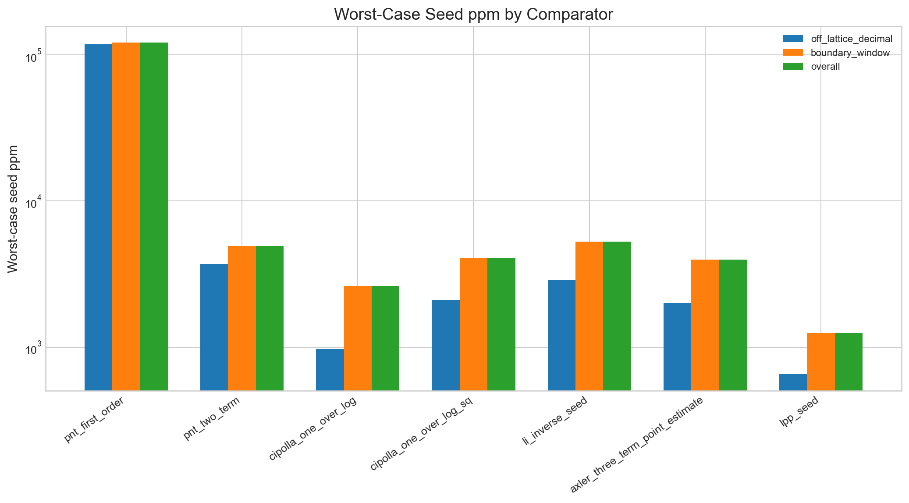
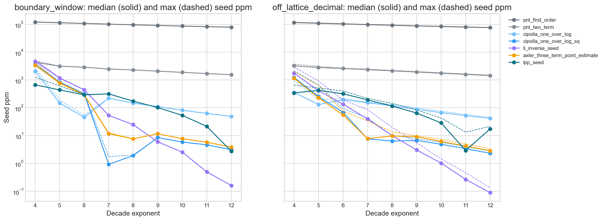
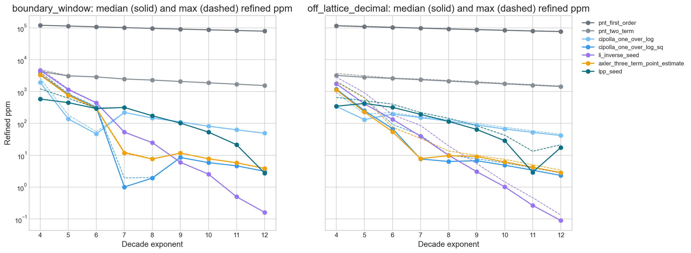
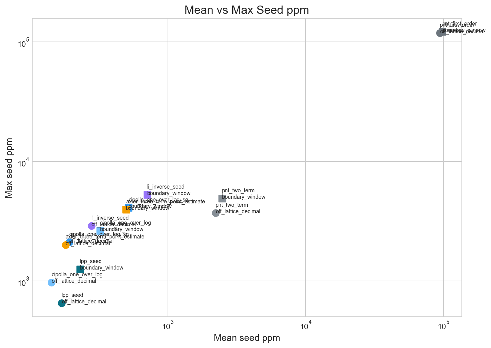
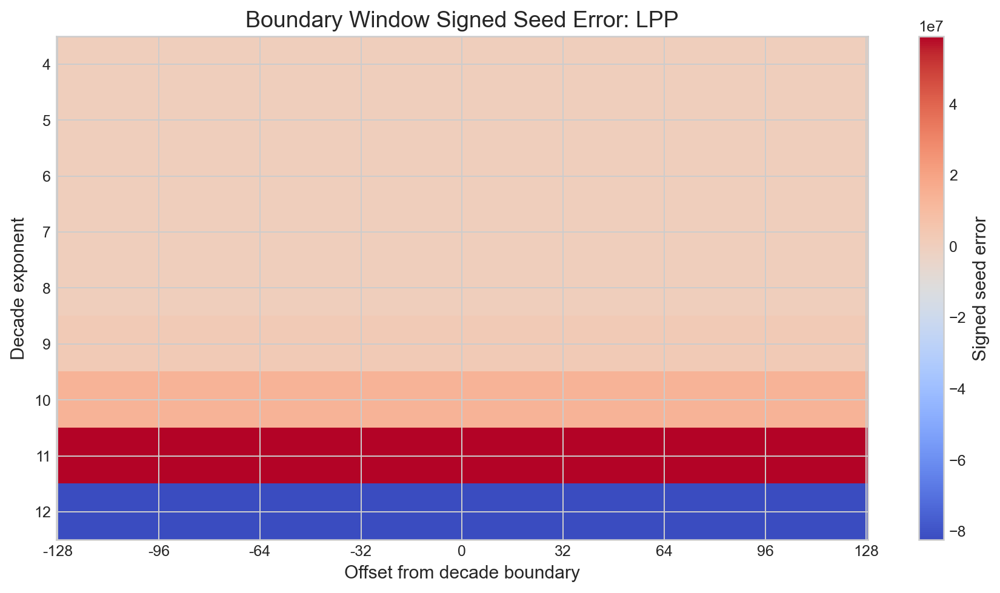
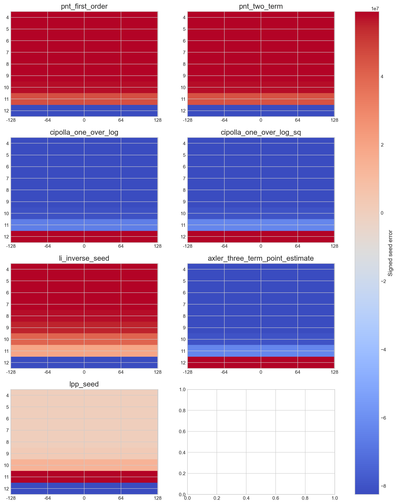
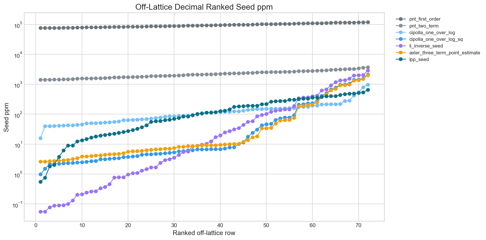
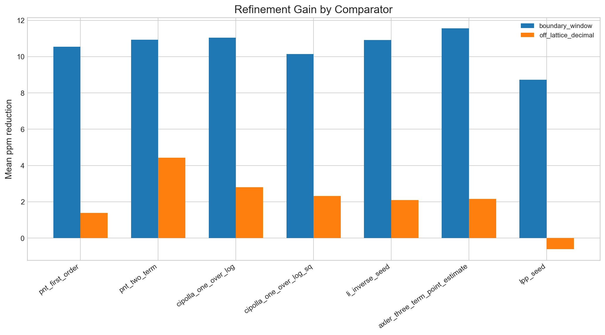

# Off-Lattice Adversarial Benchmark

LPP survives off-lattice adversarial sampling on worst-case seed ppm across both declared families.

## Horizon

Exact held-out range: $10^4 \ldots 10^{12}$.

Families:

- `off_lattice_decimal`: $m \cdot 10^k$ for $m = 2,\dots,9$ and $k = 4,\dots,12$
- `boundary_window`: all integers in $[10^k - 128,\; 10^k + 128]$ for $k = 4,\dots,12$

## Seed Results by Family

| Family | Comparator | Mean ppm | Median ppm | Max ppm | RMS ppm | Sign ratio |
| --- | --- | ---: | ---: | ---: | ---: | ---: |
| boundary_window | pnt_first_order | 97764.034569 | 96172.461090 | 121341.246405 | 98712.560435 | 0.000000 |
| boundary_window | pnt_two_term | 2473.234041 | 2286.110746 | 4905.591412 | 2606.018902 | 0.000000 |
| boundary_window | cipolla_one_over_log | 321.764528 | 110.632848 | 2626.237362 | 695.381615 | 0.779939 |
| boundary_window | cipolla_one_over_log_sq | 517.671217 | 5.845493 | 4098.084675 | 1208.253973 | 0.658885 |
| boundary_window | li_inverse_seed | 706.496554 | 24.687022 | 5271.714558 | 1615.285017 | 0.000000 |
| boundary_window | axler_three_term_point_estimate | 497.114974 | 11.628181 | 3963.405835 | 1160.179914 | 0.666667 |
| boundary_window | lpp_seed | 230.873811 | 172.626136 | 1250.589220 | 322.371815 | 0.777778 |
| off_lattice_decimal | pnt_first_order | 94222.606928 | 92420.031343 | 118658.698835 | 95102.420590 | 0.000000 |
| off_lattice_decimal | pnt_two_term | 2218.751777 | 2128.455972 | 3698.580425 | 2295.651999 | 0.000000 |
| off_lattice_decimal | cipolla_one_over_log | 143.172977 | 110.939769 | 970.022738 | 209.063416 | 0.861111 |
| off_lattice_decimal | cipolla_one_over_log_sq | 192.462743 | 6.708583 | 2104.682362 | 467.997894 | 0.583333 |
| off_lattice_decimal | li_inverse_seed | 278.403214 | 9.991065 | 2896.719276 | 652.044331 | 0.000000 |
| off_lattice_decimal | axler_three_term_point_estimate | 180.870118 | 9.107631 | 2006.790159 | 443.160065 | 0.611111 |
| off_lattice_decimal | lpp_seed | 169.462627 | 109.302036 | 651.648898 | 236.894156 | 0.847222 |

## Refined Results by Family

| Family | Comparator | Mean ppm | Median ppm | Max ppm | RMS ppm | Sign ratio |
| --- | --- | ---: | ---: | ---: | ---: | ---: |
| boundary_window | pnt_first_order | 97753.482893 | 96172.455795 | 121209.204739 | 98699.731408 | 0.000000 |
| boundary_window | pnt_two_term | 2462.306464 | 2286.104212 | 4867.116186 | 2588.658697 | 0.000000 |
| boundary_window | cipolla_one_over_log | 310.718666 | 110.633110 | 2597.377611 | 665.575050 | 0.779939 |
| boundary_window | cipolla_one_over_log_sq | 507.534994 | 5.845596 | 4059.605006 | 1181.323307 | 0.658885 |
| boundary_window | li_inverse_seed | 695.583027 | 24.678187 | 5213.995055 | 1586.222048 | 0.000000 |
| boundary_window | axler_three_term_point_estimate | 485.562274 | 11.631558 | 3943.710743 | 1129.189091 | 0.666667 |
| boundary_window | lpp_seed | 222.140825 | 172.631570 | 1211.969643 | 304.366198 | 0.777778 |
| off_lattice_decimal | pnt_first_order | 94221.222093 | 92420.029397 | 118645.349898 | 95100.753089 | 0.000000 |
| off_lattice_decimal | pnt_two_term | 2214.327311 | 2128.452140 | 3687.867665 | 2289.352234 | 0.000000 |
| off_lattice_decimal | cipolla_one_over_log | 140.375239 | 110.942874 | 934.425573 | 202.015322 | 0.861111 |
| off_lattice_decimal | cipolla_one_over_log_sq | 190.146782 | 6.708802 | 2091.333425 | 462.531502 | 0.583333 |
| off_lattice_decimal | li_inverse_seed | 276.307883 | 9.986834 | 2829.974593 | 645.156396 | 0.000000 |
| off_lattice_decimal | axler_three_term_point_estimate | 178.717764 | 9.107713 | 1984.541931 | 437.784448 | 0.611111 |
| off_lattice_decimal | lpp_seed | 170.078788 | 109.302855 | 652.782201 | 238.414557 | 0.847222 |

## Worst-Case Seed Rows

| Comparator | Family | n | Seed ppm | Seed signed error |
| --- | --- | ---: | ---: | ---: |
| pnt_first_order | boundary_window | 9926 | 121341.246405 | -12615 |
| pnt_first_order | boundary_window | 9925 | 121336.014084 | -12613 |
| pnt_first_order | boundary_window | 9927 | 121278.867333 | -12609 |
| pnt_first_order | boundary_window | 9922 | 121228.453461 | -12596 |
| pnt_first_order | boundary_window | 10118 | 121226.961509 | -12872 |
| pnt_first_order | boundary_window | 9923 | 121207.163685 | -12595 |
| pnt_first_order | boundary_window | 9921 | 121206.287480 | -12592 |
| pnt_first_order | boundary_window | 9928 | 121189.970087 | -12600 |
| pnt_first_order | boundary_window | 10119 | 121182.442295 | -12868 |
| pnt_first_order | boundary_window | 9929 | 121178.314852 | -12600 |

## Worst-Case Refined Rows

| Comparator | Family | n | Refined ppm | Refined signed error |
| --- | --- | ---: | ---: | ---: |
| pnt_first_order | boundary_window | 9922 | 121209.204739 | -12594 |
| pnt_first_order | boundary_window | 9921 | 121206.287480 | -12592 |
| pnt_first_order | boundary_window | 9927 | 121192.301403 | -12600 |
| pnt_first_order | boundary_window | 9928 | 121189.970087 | -12600 |
| pnt_first_order | boundary_window | 10119 | 121182.442295 | -12868 |
| pnt_first_order | boundary_window | 9929 | 121159.080199 | -12598 |
| pnt_first_order | boundary_window | 9926 | 121158.489078 | -12596 |
| pnt_first_order | boundary_window | 9924 | 121132.805358 | -12588 |
| pnt_first_order | boundary_window | 10118 | 121132.782701 | -12862 |
| pnt_first_order | boundary_window | 10112 | 121127.583574 | -12852 |

## Visualization Index

### Worst-Case Seed ppm by Comparator

This is the headline chart for the lattice-artifact question because it compares worst-case seed behavior directly by family and overall.

### Seed ppm by Family and Decade

This figure shows whether family-level seed behavior stays stable across decades or breaks near the upper end of the exact horizon.

### Refined ppm by Family and Decade

This figure shows how much of the seed structure survives after shared prime refinement.

### Mean vs Max Seed ppm Scatter

This plot makes the average-versus-tail tradeoff visible, so a comparator with a mild mean but a bad tail cannot hide inside aggregate tables.

### Boundary Window Signed Seed Error for LPP

This heatmap shows whether LPP develops systematic signed structure near decade transitions.

### Boundary Window Signed Seed Error for All Comparators

This faceted heatmap shows whether LPP behaves differently from the classical seeds at decade boundaries.

### Ranked Off-Lattice Decimal Seed ppm

This ranked plot exposes tail behavior inside the off-lattice family without smoothing away the worst rows.

### Refinement Gain by Comparator

This bar chart shows whether the seed architecture advantage survives before refinement or is mostly washed out by the shared prime step.

## Conclusion

LPP survives off-lattice adversarial sampling on worst-case seed ppm across both declared families.
