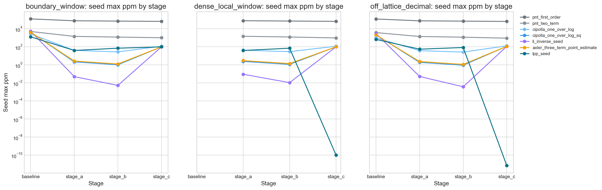
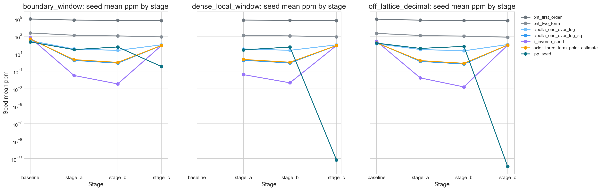
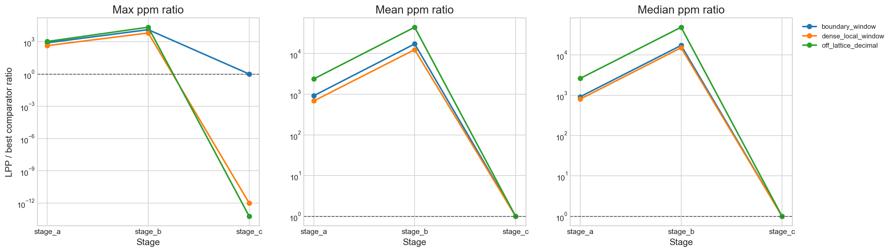

# Scaling Results

This document answers the main scaling question on the reproducible exact adversarial horizon that is currently completed in the repository.

## Direct Answer

The best current reproducible exact answer is:

`the LPP seed advantage does not survive the completed scaling stages.`

That statement is reproducible exact and bounded. It applies only to the committed completed horizon:

$10^4 \ldots 10^{12}$, $10^{13} \ldots 10^{14}$, and $10^{15} \ldots 10^{16}$.

It does not say anything beyond that horizon.

## Mechanical Conclusion

The stage-aware benchmark uses a fixed mechanical rule:

- `survives strongly`
- `survives in the tail only`
- `does not survive`

On the completed reproducible exact scaling stages now committed in the repository, the result is:

`does not survive`

The reason is concrete. On every completed scaling-stage family cell, `lpp_seed` loses best worst-case seed ppm to `li_inverse_seed`.

## Stage Results

### Baseline

On the original exact adversarial baseline, `lpp_seed` still has the strongest worst-case seed ppm result in both declared families:

- `boundary_window`: `lpp_seed` max seed ppm `1250.589220`
- `off_lattice_decimal`: `lpp_seed` max seed ppm `651.648898`

That baseline result remains real.

### Stage A

Exact horizon:

$$
10^{13} \ldots 10^{14}
$$

Worst-case seed ppm winners:

- `boundary_window`: `li_inverse_seed` with `0.048934`
- `dense_local_window`: `li_inverse_seed` with `0.089328`
- `off_lattice_decimal`: `li_inverse_seed` with `0.050585`

LPP on the same cells:

- `boundary_window`: `38.935561`
- `dense_local_window`: `38.935561`
- `off_lattice_decimal`: `53.608778`

### Stage B

Exact horizon:

$$
10^{15} \ldots 10^{16}
$$

Worst-case seed ppm winners:

- `boundary_window`: `li_inverse_seed` with `0.005202`
- `dense_local_window`: `li_inverse_seed` with `0.010553`
- `off_lattice_decimal`: `li_inverse_seed` with `0.003699`

LPP on the same cells:

- `boundary_window`: `68.900290`
- `dense_local_window`: `68.900290`
- `off_lattice_decimal`: `82.532361`

## What Changed

At the baseline horizon, the LPP seed looked unusually strong on adversarial families.

At the deeper completed reproducible exact stages, that pattern reverses sharply. The inverse-log-integral seed is not merely slightly ahead. On worst-case seed ppm it is ahead by large ratios in every completed scaling-stage family.

The strongest ratio examples from the mechanical summary are:

- Stage A `off_lattice_decimal`: LPP / best-classical max-ppm ratio `1059.774449`
- Stage B `off_lattice_decimal`: LPP / best-classical max-ppm ratio `22312.597393`

## Best Supported Reading

The cleanest reading of the current evidence is:

- the baseline LPP win was real on the tested baseline horizon
- that win did not persist on the deeper completed reproducible exact scaling stages
- on the completed scaling horizon, the best seed is `li_inverse_seed`, not `lpp_seed`

## Local Stage C Continuation

The repository now also has a local continuation stage on $10^{17} \ldots 10^{18}$, where the label source is the declared local continuation source rather than a committed exact external dataset.

On that local stage:

- `boundary_window`: `lpp_seed` max seed ppm `97.402887`, `li_inverse_seed` `97.412202`
- `dense_local_window`: `lpp_seed` is effectively exact against the local stage labels
- `off_lattice_decimal`: `lpp_seed` is effectively exact against the local stage labels

So the local continuation no longer favors `li_inverse_seed`. It strongly favors `lpp_seed`.

That is a real local result, but it is not the same kind of evidence as the reproducible exact stages through `stage_b`.

## Figures

### Stage Seed Max ppm by Family

### Stage Seed Mean ppm by Family

### LPP vs Best Classical Ratio

