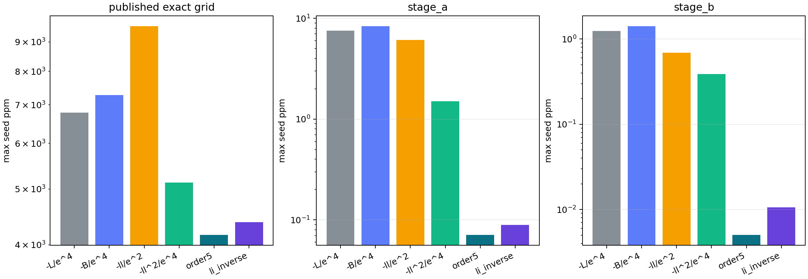
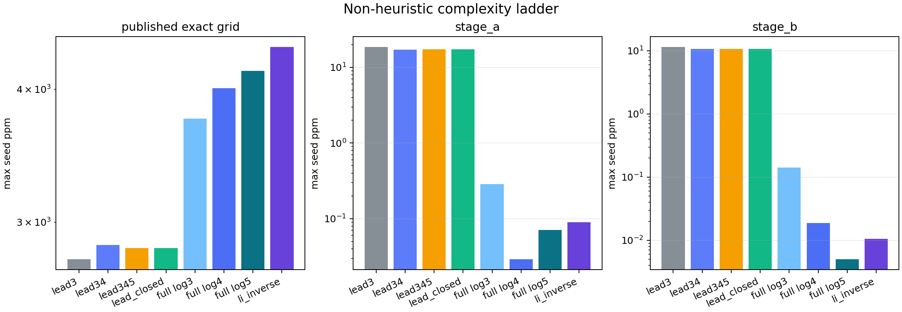
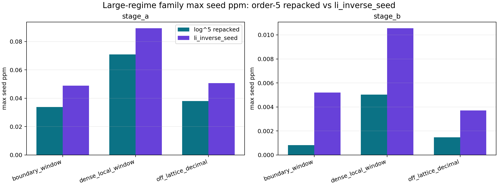
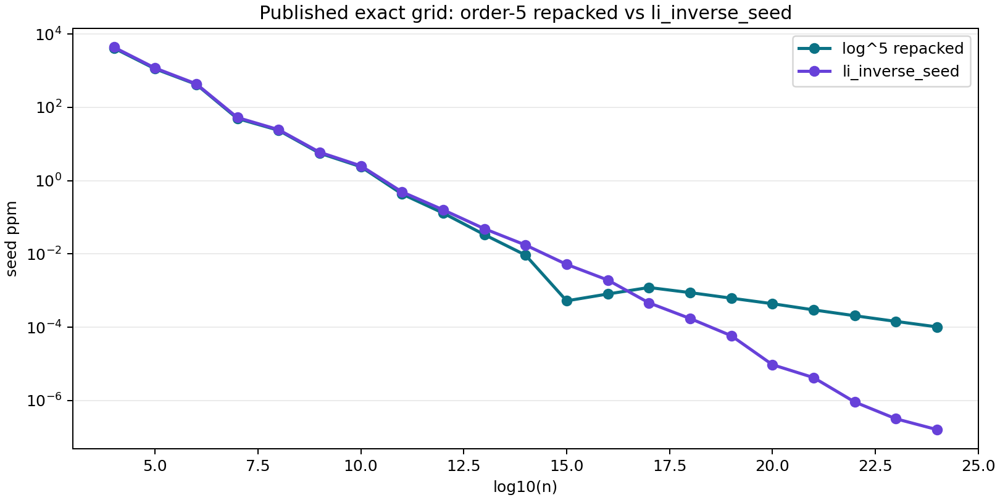
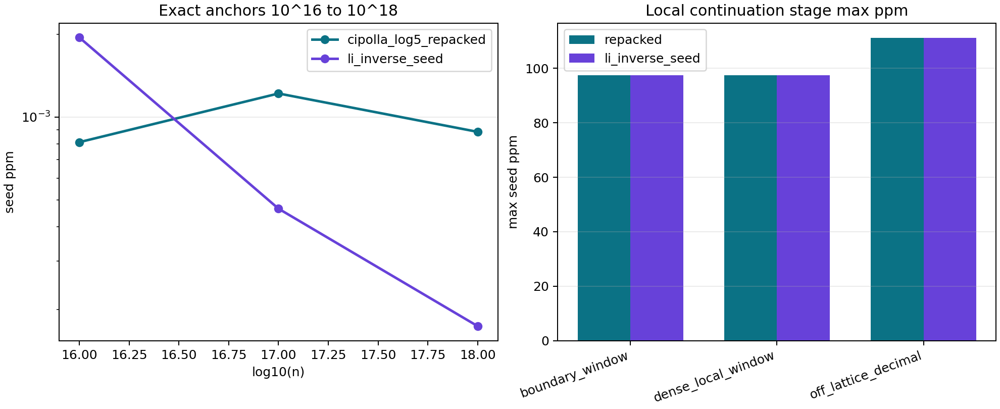

# Evidence Package: Derived Seed Search Against `li_inverse_seed`

GitHub folder: [docs/evidence_package/](https://github.com/zfifteen/lorentz-prime-predictor/tree/main/docs/evidence_package)

## Algorithm Problem

The problem is to derive a closed-form seed for the $n$th prime that stays non-heuristic and overtakes `li_inverse_seed` in the large exact regimes.

That requirement is stricter than "find the most accurate formula." A candidate only counts if its shape and coefficients are forced by the derivation. A candidate that performs well because it hides a chosen coefficient is rejected even if the benchmark numbers look strong.

This package collects the evidence that has already been generated in this repository and states the current boundary through exact `10^18`.

## Boundaries, Requirements, and Constraints

- No heuristic coefficients.
- No fitted decimal constants.
- No fallback logic or alternate execution paths.
- No `primecount`.
- GitHub-safe math notation only.
- Exact evidence and local continuation are separate evidence classes.

The benchmark target is not merely to look good on low anchors. The target is to beat `li_inverse_seed` on the committed exact large-regime artifacts.

## What Has Already Been Tried

The search has already covered four distinct categories.

| candidate family | derivation status | outcome |
| --- | --- | --- |
| ratio and invariant-style `k^*(n)` experiments | rejected heuristic | Some were empirically strong, but they introduced chosen coefficients or shapes that were not forced by the derivation. |
| strict `B(n)`-series truncations | derived | Honest, but not strong enough to beat `li_inverse_seed` on the exact large stages. |
| leading-log simplifications of the Cipolla residual | derived | Simpler, but they lose too much structure and fail before the large-stage target is met. |
| full repacked Cipolla candidates | derived | The first winning rung is the order-5 repacked candidate. |

One rejected heuristic pattern is worth showing plainly because it performed well enough to be tempting. It improved low-to-mid regime behavior by compressing the residual into a single invariant-style lift, but the gain came from a chosen coefficient rather than a derived one, so it does not qualify.

Data:
- [`data/simple_invariant_k_candidates.csv`](data/simple_invariant_k_candidates.csv)
- [GitHub blob](https://github.com/zfifteen/lorentz-prime-predictor/blob/main/docs/evidence_package/data/simple_invariant_k_candidates.csv)

## Non-Heuristic Search Ladder

The non-heuristic ladder asked a narrow question: how simple can the derived residual become before it stops beating `li_inverse_seed`?

The answer is now clear from the existing probe set. The large-stage win does not survive the leading-log closed form, and it does not survive the full order-4 repacking either. The first fully derived rung that clears the exact large-stage bar is the full order-5 repacked candidate.

Data:
- [`data/complexity_ladder_summary.csv`](data/complexity_ladder_summary.csv)
- [GitHub blob](https://github.com/zfifteen/lorentz-prime-predictor/blob/main/docs/evidence_package/data/complexity_ladder_summary.csv)

## Strongest Supported Result

The strongest supported result in the current repository is:

`cipolla_log5_repacked` is the first fully derived candidate that beats `li_inverse_seed` on exact `stage_a` and exact `stage_b`.

Exact stage-family comparison:

Key exact results:

- `stage_a` max seed ppm:
  `cipolla_log5_repacked = 0.070933`
  `li_inverse_seed = 0.089328`
- `stage_b` max seed ppm:
  `cipolla_log5_repacked = 0.005033`
  `li_inverse_seed = 0.010553`

Data:
- [`data/stage_family_summary.csv`](data/stage_family_summary.csv)
- [GitHub blob](https://github.com/zfifteen/lorentz-prime-predictor/blob/main/docs/evidence_package/data/stage_family_summary.csv)

## Boundary Through `10^18`

The order-5 repacked candidate does not stay in front forever.

On the exact anchor grid, it leads through exact `10^16`, then loses at exact `10^17` and exact `10^18`.

- exact `10^16`:
  `cipolla_log5_repacked = 0.0008106978` ppm
  `li_inverse_seed = 0.0019482722` ppm
- exact `10^17`:
  `cipolla_log5_repacked = 0.0012186782` ppm
  `li_inverse_seed = 0.0004646402` ppm
- exact `10^18`:
  `cipolla_log5_repacked = 0.0008837411` ppm
  `li_inverse_seed = 0.0001737584` ppm

Published exact point comparison:

Post-`10^16` boundary view:

The checked local continuation stage also shows no regain before `10^18`. `li_inverse_seed` stays slightly better in all three checked families there.

Data:
- [`data/anchor_1e16_to_1e18_comparison.csv`](data/anchor_1e16_to_1e18_comparison.csv)
- [GitHub blob](https://github.com/zfifteen/lorentz-prime-predictor/blob/main/docs/evidence_package/data/anchor_1e16_to_1e18_comparison.csv)
- [`data/stage_c_local_order5_vs_li.csv`](data/stage_c_local_order5_vs_li.csv)
- [GitHub blob](https://github.com/zfifteen/lorentz-prime-predictor/blob/main/docs/evidence_package/data/stage_c_local_order5_vs_li.csv)

## Current Reading

The current evidence supports five plain conclusions.

1. A purely heuristic `k^*(n)` can look strong, but it does not satisfy the derivation standard.
2. The strict derived `B(n)`-series lifts are honest, but they are not strong enough in the exact large regimes.
3. Simpler leading-log repackings lose too much structure.
4. Full repacked order 5 is the first derived candidate that beats `li_inverse_seed` on exact `stage_a` and exact `stage_b`.
5. That lead does not continue past exact `10^16` in the current evidence.

## Open Problem

The open problem is now narrower and cleaner:

derive a stronger closed-form seed that remains non-heuristic and also beats `li_inverse_seed` beyond exact `10^16`, without smuggling in chosen coefficients, fitted constants, or fallback logic.
